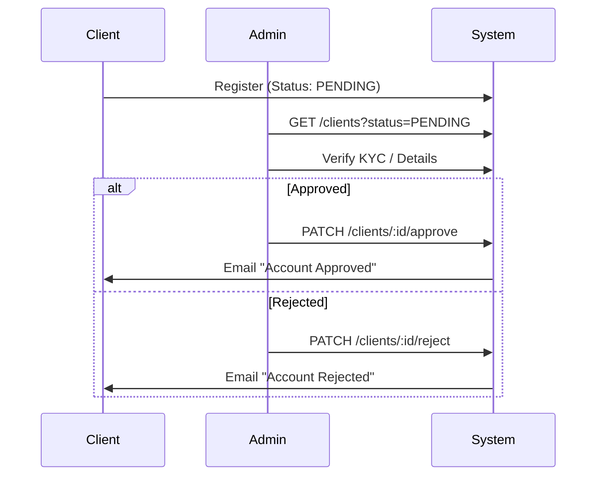

# Admin API

## Overview
Endpoints for `SYSTEM_ADMIN` and `ROOT_ADMIN` to manage platform-wide resources, specifically Client verification and User oversight.

## Client Approval Flow



## Endpoints

### 1. Approve Client
- **URL**: `/mba/api/v1/admin/clients/:clientId/approve`
- **Method**: `PATCH`
- **Auth**: Required (`ADMIN`)

#### Response Example
```json
{
    "status": "success",
    "message": "Client approved successfully",
    "data": {
        "client": { "id": "...", "clientStatus": "APPROVED" }
    }
}
```

---

### 2. Reject Client
- **URL**: `/mba/api/v1/admin/clients/:clientId/reject`
- **Method**: `PATCH`
- **Auth**: Required (`ADMIN`)

#### Request Example
```json
{ "reason": "Invalid business documents" }
```

---

### 3. List Users
- **URL**: `/mba/api/v1/admin/users`
- **Method**: `GET`
- **Auth**: Required (`ADMIN`)

#### Query Params
- `role`: `CUSTOMER`, `CLIENT`, `SYSTEM_ADMIN`
- `status`: `PENDING`, `APPROVED` (for clients)
- `limit`, `page`

#### Response Example
```json
{
    "status": "success",
    "results": 50,
    "data": {
        "users": [ ... ]
    }
}
```
