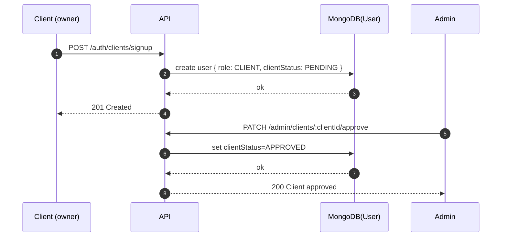

## Admin Module Docs (v1)

This document explains the **admin module** in this project:

- what admins can do
- how admin endpoints are protected
- how the **client approval** workflow works

Base path:

```
/mba/api/v1
```

---

## 1) Who is an Admin?

### Roles

- `ROOT_ADMIN`
  - seeded directly in DB (no public API to create)
  - full system access

- `SYSTEM_ADMIN`
  - administrator of the whole system
  - super-user access to manage platform resources

Admin endpoints are protected by:

- `authenticate` (valid access token)
- `requireRole(ROOT_ADMIN, SYSTEM_ADMIN)`

Code reference:

- `src/modules/admin/admin.routes.ts`
- `src/modules/auth/auth.middleware.ts`

---

## 2) Admin router

Mounted at:

```
/mba/api/v1/admin
```

Routes file:

- `src/modules/admin/admin.routes.ts`

---

## 3) Client approval workflow

### Why client approval?

Clients are theatre owners. A client account must be reviewed/approved before it can perform client-only actions (like creating theatres).

When a client signs up via:

```
POST /mba/api/v1/auth/clients/signup
```

the user is created with:

- `role = CLIENT`
- `clientStatus = PENDING`

Only an admin can move it to:

- `APPROVED` (client can operate)
- `REJECTED` (client cannot operate)

### Data flow (Mermaid)



---

## 4) Endpoints

### 4.1 Approve client

```
PATCH : /mba/api/v1/admin/clients/:clientId/approve
```

Auth:

- Required: `Authorization: Bearer <accessToken>`
- Role required: `ROOT_ADMIN` or `SYSTEM_ADMIN`

Path params:

- `clientId`: Mongo ObjectId (24 hex chars)

Response (example):

```json
{
  "message": "Client approved",
  "client": {
    "id": "<clientId>",
    "email": "client@example.com",
    "role": "CLIENT",
    "clientStatus": "APPROVED"
  }
}
```

Errors:

- `401` unauthenticated / invalid token
- `403` unauthorized (not an admin)
- `404` client not found
- `400` user is not a client

---

### 4.2 Reject client

```
PATCH : /mba/api/v1/admin/clients/:clientId/reject
```

Auth:

- Required: `Authorization: Bearer <accessToken>`
- Role required: `ROOT_ADMIN` or `SYSTEM_ADMIN`

Path params:

- `clientId`: Mongo ObjectId

Response (example):

```json
{
  "message": "Client rejected",
  "client": {
    "id": "<clientId>",
    "email": "client@example.com",
    "role": "CLIENT",
    "clientStatus": "REJECTED"
  }
}
```

Errors:

- `401` unauthenticated / invalid token
- `403` unauthorized (not an admin)
- `404` client not found
- `400` user is not a client

---

## 5) How to extend (recommended next endpoints)

As the system grows, admin endpoints typically expand to:

- List clients by status (`PENDING`, `APPROVED`, `REJECTED`)
- View a single client profile
- Admin CRUD for:
  - Movies
  - Theatres
  - Bookings
  - Users

Implementation hint:

- Keep new endpoints under `src/modules/admin/` and mount them under `/mba/api/v1/admin`.
- Protect everything with `authenticate` + `requireRole(...)`.
