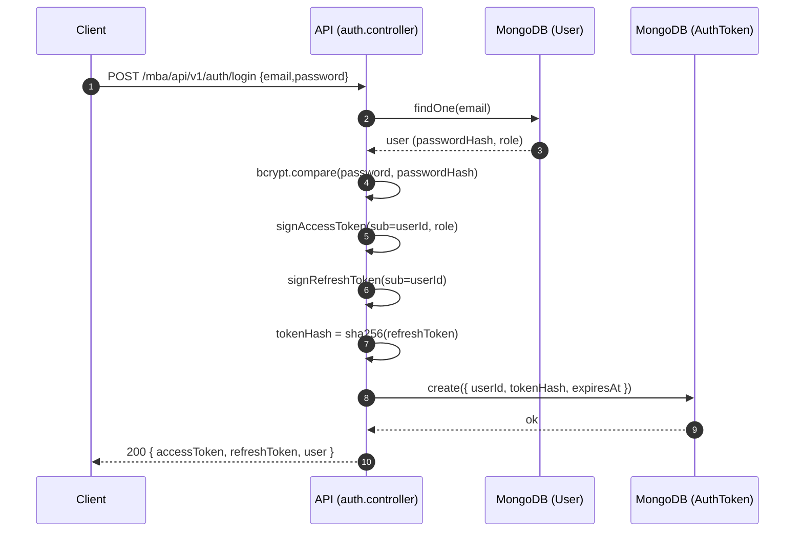
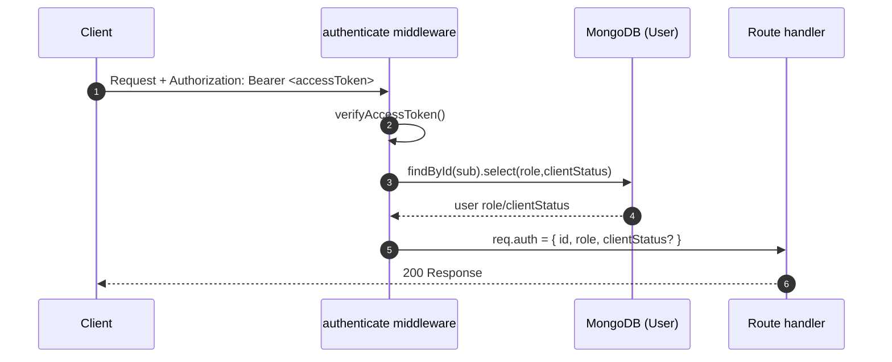
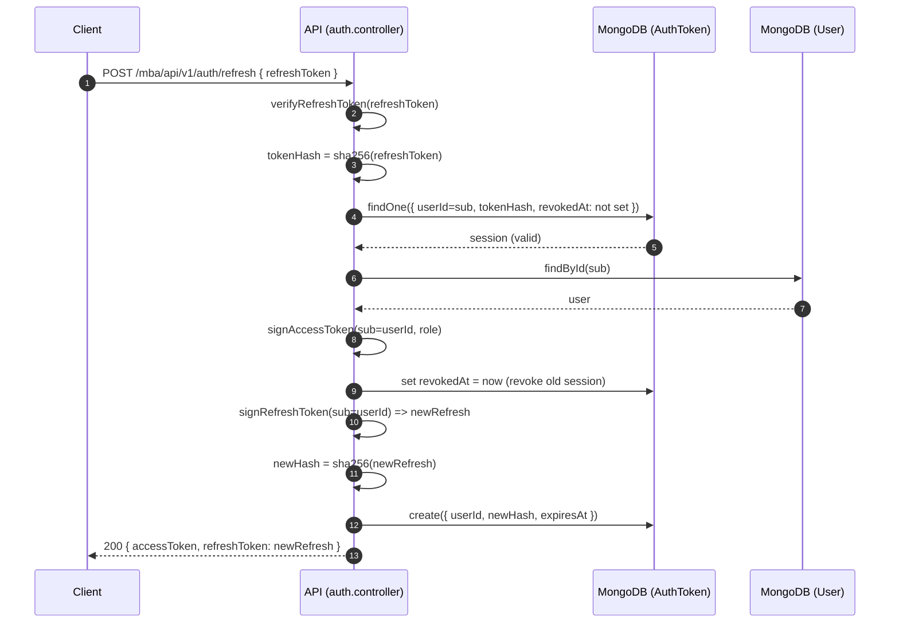
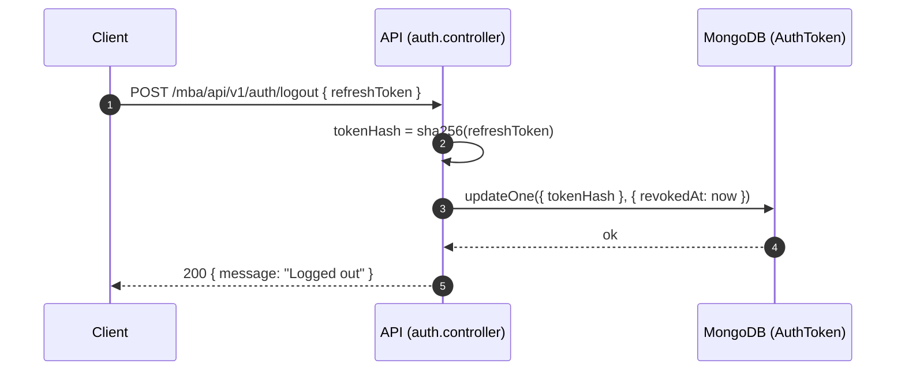

# Auth Guide (JWT + Refresh Token Rotation)

This document explains **how authentication works** in this project in a beginner-friendly way.
It covers the **architecture**, the **data flow**, and what happens on each API call.

> TL;DR: Users log in with email/password → get an **Access Token** (short-lived) + **Refresh Token** (long-lived). The access token is used for most requests. When it expires, the refresh token is used to obtain a new access token. Refresh tokens are **rotated** and stored as **hashed sessions** in MongoDB.

---

## 1) Big picture

### Why two tokens?

- **Access token** (JWT, short expiry like `15m`)
  - Sent in `Authorization: Bearer ...`
  - Used on every protected endpoint
  - If leaked, it expires quickly

- **Refresh token** (JWT, longer expiry like `30d`)
  - Used only to get a new access token
  - Stored server-side as a **session record** (hash only)
  - **Rotated on every refresh** (industry standard)

### Core goals

- Strong password storage with `bcrypt`
- Secure session handling using **refresh-token rotation**
- Role-based authorization (`ROOT_ADMIN`, `SYSTEM_ADMIN`, `CLIENT`, `CUSTOMER`)
- Client approval gate: a client must be `APPROVED` to perform client-only actions

---

## 2) Components (where to look in the code)

### Files

- `src/modules/auth/auth.controller.ts`
  - Implements the request/response logic for login/signup/refresh/logout/me

- `src/modules/auth/auth.service.ts`
  - JWT signing and verification helpers

- `src/modules/auth/auth.middleware.ts`
  - `authenticate`: reads `Authorization: Bearer <accessToken>`
  - `requireRole`: role guard
  - `requireApprovedClient`: extra guard for approved client accounts

- `src/modules/auth/auth.model.ts`
  - `AuthTokenModel`: stores refresh-token sessions (hashed)

- `src/modules/users/user.model.ts`
  - `UserModel`: stores users, roles, passwordHash, and clientStatus

- `src/config/env.ts`
  - Environment validation (Zod) and required auth configs

---

## 3) Data model (AuthToken sessions)

### User document (simplified)

A `User` has:

- `email`, `passwordHash`
- `role`: `ROOT_ADMIN | SYSTEM_ADMIN | CLIENT | CUSTOMER`
- `clientStatus`: `PENDING | APPROVED | REJECTED` (only meaningful for `CLIENT`)

### AuthToken document

A refresh token session is stored as:

- `userId`
- `tokenHash` (SHA-256 hash of refresh token)
- `revokedAt` (when rotated or logged out)
- `expiresAt` (TTL index auto-deletes tokens)

Important: **the raw refresh token is never stored**.

---

## 4) Environment variables you must set

These are required to boot the server:

- `MONGODB_URL`
- `JWT_ACCESS_SECRET` (>= 20 chars, should be long/random in production)
- `JWT_REFRESH_SECRET` (>= 20 chars)

Optional / defaults:

- `JWT_ISSUER` (default `movie-booking-api`)
- `JWT_AUDIENCE` (default `movie-booking-app`)
- `JWT_ACCESS_EXPIRES_IN` (default `15m`)
- `JWT_REFRESH_EXPIRES_IN` (default `30d`)
- `BCRYPT_SALT_ROUNDS` (default `12`)

---

## 5) API endpoints (Auth)

All routes are mounted under:

```
/mba/api/v1
```

### Customer signup

```
POST /auth/signup
```

### Client signup (requires admin approval)

```
POST /auth/clients/signup
```

### Login

```
POST /auth/login
```

Returns:

- `accessToken`
- `refreshToken`
- `user`

### Refresh (rotate refresh token)

```
POST /auth/refresh
```

Body:

```json
{ "refreshToken": "<jwt>" }
```

Returns a **new** access token and a **new** refresh token.
The old refresh token is revoked.

### Logout

```
POST /auth/logout
```

Body:

```json
{ "refreshToken": "<jwt>" }
```

Marks the refresh token session as revoked.

### Me

```
GET /auth/me
```

Requires:

```
Authorization: Bearer <accessToken>
```

---

## 6) Data flow diagrams

### Mermaid diagrams (GitHub-rendered)

> These diagrams render automatically on GitHub and many Markdown viewers that support Mermaid.

#### A) Login flow



#### B) Protected request



#### C) Refresh flow (rotation)



#### D) Logout flow



### A) Login flow

```text
Client
  |
  | POST /auth/login  { email, password }
  v
Auth Controller
  |
  | 1) Find user by email
  | 2) bcrypt.compare(password, passwordHash)
  | 3) signAccessToken({ sub: userId, role })
  | 4) signRefreshToken({ sub: userId })
  | 5) hash refreshToken -> tokenHash
  | 6) AuthTokenModel.create({ userId, tokenHash, expiresAt })
  v
Client receives:
  - accessToken (short-lived)
  - refreshToken (long-lived)
```

### B) Calling protected APIs

```text
Client
  |
  | GET /some/protected/resource
  | Authorization: Bearer <accessToken>
  v
authenticate middleware
  |
  | 1) verifyAccessToken()
  | 2) fetch minimal user (role/clientStatus)
  | 3) attach req.auth = { id, role, clientStatus? }
  v
Controller executes
```

### C) Refresh flow (rotation)

```text
Client
  |
  | POST /auth/refresh { refreshToken }
  v
Auth Controller
  |
  | 1) verifyRefreshToken(refreshToken)
  | 2) tokenHash = sha256(refreshToken)
  | 3) find session { userId, tokenHash, revokedAt: not set }
  | 4) revoke old session (set revokedAt)
  | 5) create NEW refresh token + store new tokenHash
  | 6) issue new access token
  v
Client receives:
  - new accessToken
  - new refreshToken

Old refreshToken no longer works.
```

### D) Logout flow

```text
Client
  |
  | POST /auth/logout { refreshToken }
  v
Auth Controller
  |
  | tokenHash = sha256(refreshToken)
  | AuthTokenModel.updateOne({ tokenHash }, { revokedAt: now })
  v
Client is logged out (refresh token invalid)
```

---

## 7) Role-based authorization (RBAC)

### How roles are checked

- `authenticate` verifies JWT and loads `req.auth`
- `requireRole(...)` checks if `req.auth.role` is allowed

Example usage pattern:

```ts
router.use(authenticate);
router.use(requireRole(UserRole.ROOT_ADMIN, UserRole.SYSTEM_ADMIN));
```

### Client approval gate

Clients sign up in `PENDING` state:

- Allowed: login, browse public data
- Blocked: client-only actions (like creating theatres)

Guard:

- `requireApprovedClient` ensures:
  - role is `CLIENT`
  - `clientStatus === APPROVED`

---

## 8) Admin client approval

Admin routes:

- `PATCH /mba/api/v1/admin/clients/:clientId/approve`
- `PATCH /mba/api/v1/admin/clients/:clientId/reject`

See also:

- `docs/admin.docs.md` (detailed admin module + approval workflow)

Protected by:

- `authenticate`
- `requireRole(ROOT_ADMIN, SYSTEM_ADMIN)`

---

## 9) Security notes (practical)

### What’s already good here

- Passwords are hashed with bcrypt (never stored in plaintext)
- Refresh tokens are stored as *hash only*
- Refresh token rotation reduces replay risk
- TTL index cleans up expired sessions

### Recommended next hardening steps

1. Store refresh token in **HttpOnly cookies** instead of JSON response
2. Add CSRF protection if using cookies
3. Add rate limiting specifically for `/auth/login` and `/auth/refresh`
4. Consider account lockout / exponential backoff on failed logins
5. Add audit fields for admin approvals (`approvedAt`, `approvedBy`, `rejectReason`)

---

## 10) Common troubleshooting

- **Server fails to start with env validation error**
  - Make sure `MONGODB_URL`, `JWT_ACCESS_SECRET`, `JWT_REFRESH_SECRET` are set

- **401 Invalid token**
  - Access token expired → call `/auth/refresh`
  - Using old refresh token after refresh → expected; rotation revokes it

- **Client can’t create theatres**
  - Client status is `PENDING` or `REJECTED` → admin must approve
