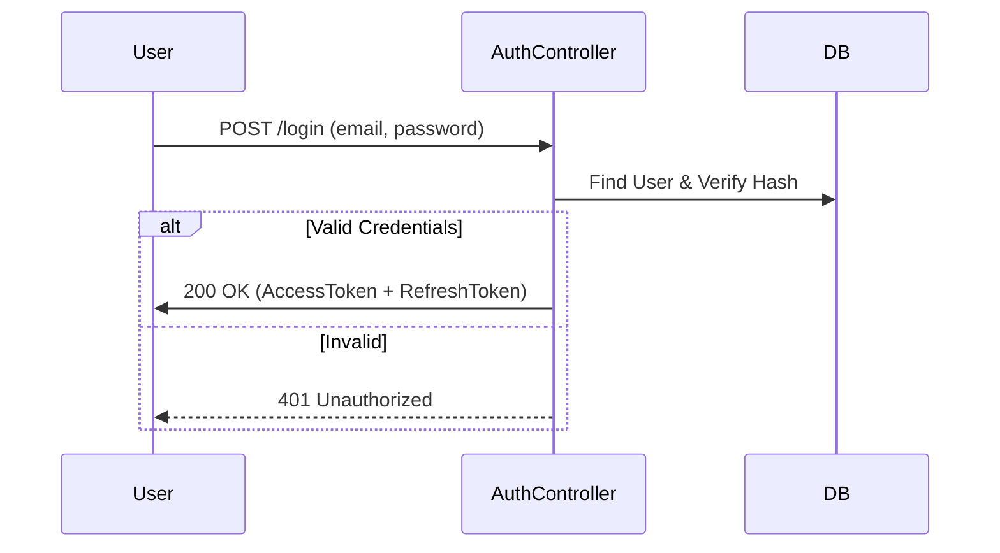

# Authentication API

## Overview
This module handles user registration, login, and session management using JWT (JSON Web Tokens). Access and Refresh tokens are used for enhanced security.

## Authentication Flow



## Endpoints

### 1. Sign up (Customer)
Registers a new customer account.

- **URL**: `/mba/api/v1/auth/signup`
- **Method**: `POST`
- **Auth**: Public

#### Request Example
```json
{
    "name": "Alex Doe",
    "email": "alex@example.com",
    "password": "StrongPassword!123",
    "phone": "+19876543210"
}
```

#### Response Example (201 Created)
```json
{
    "status": "success",
    "data": {
        "user": {
            "id": "60d5ec49f1b2c8b1f8c8e1a1",
            "name": "Alex Doe",
            "email": "alex@example.com",
            "role": "CUSTOMER"
        }
    }
}
```

---

### 2. Sign up (Client)
Registers a new client/partner. **Note:** Account status defaults to `PENDING` and requires Admin approval.

- **URL**: `/mba/api/v1/auth/clients/signup`
- **Method**: `POST`
- **Auth**: Public

#### Request Example
```json
{
    "ownerName": "Sam Smith",
    "companyName": "Sam Cinemas Pvt Ltd",
    "email": "sam@samcinemas.com",
    "password": "StrongPassword!123",
    "phone": "+1-555-123-4567"
}
```

#### Response Example (201 Created)
```json
{
    "status": "success",
    "data": {
        "user": {
            "id": "60d5ec...",
            "email": "sam@samcinemas.com",
            "role": "CLIENT",
            "clientStatus": "PENDING"
        }
    }
}
```

---

### 3. Login
Authenticates users and issues tokens.

- **URL**: `/mba/api/v1/auth/login`
- **Method**: `POST`
- **Auth**: Public

#### Request Example
```json
{
    "email": "alex@example.com",
    "password": "StrongPassword!123"
}
```

#### Response Example (200 OK)
```json
{
    "status": "success",
    "data": {
        "accessToken": "eyJhbGciOiJIUzI1Ni...",
        "refreshToken": "d76f8a...",
        "user": {
            "id": "60d5ec...",
            "email": "alex@example.com",
            "role": "CUSTOMER"
        }
    }
}
```

---

### 4. Refresh Token
Exchanges a valid refresh token for a new access token.

- **URL**: `/mba/api/v1/auth/refresh`
- **Method**: `POST`
- **Auth**: Public

#### Request Example
```json
{
    "refreshToken": "d76f8a..."
}
```

#### Response Example (200 OK)
```json
{
    "status": "success",
    "data": {
        "accessToken": "eyJhbGciOiJIUzI1Ni...",
        "refreshToken": "new_refresh_token..."
    }
}
```

---

### 5. Logout
Invalidates the refresh token.

- **URL**: `/mba/api/v1/auth/logout`
- **Method**: `POST`
- **Auth**: Required (Bearer Token)

#### Request Example
```json
{
    "refreshToken": "d76f8a..."
}
```

#### Response Example (200 OK)
```json
{
    "status": "success",
    "message": "Logged out successfully"
}
```
