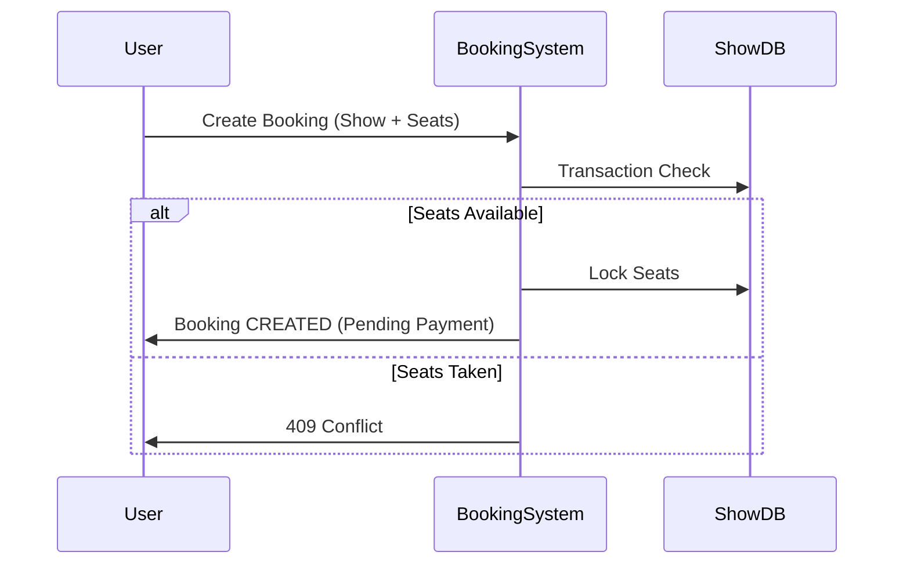

# Bookings API

## Overview
The Booking module handles ticket reservations. It uses optimistic concurrency control (via MongoDB transactions) to ensure no double-booking of seats occurs.

## Booking State Machine
Bookings transition through the following states:

- `CREATED`: Initial state when user selects seats. Seats are temporarily reserved.
- `CONFIRMED`: Payment successful. Seats are permanently locked.
- `CANCELLED`: User or Admin cancelled the booking. Seats released.
- `EXPIRED` (Future): Payment timeout. Seats released.

## Booking Flow



## Endpoints

### 1. Create Booking
Creates a new pending booking. 

- **URL**: `/mba/api/v1/bookings`
- **Method**: `POST`
- **Auth**: Required (`CUSTOMER`)

#### Request Example
```json
{
    "showId": "60d5ec...",
    "seats": ["A1", "A2"],
    "paymentMode": "CARD" 
}
```

#### Response Example (201 Created)
```json
{
    "status": "success",
    "data": {
        "booking": {
            "id": "60d6a...",
            "status": "CREATED",
            "seats": ["A1", "A2"],
            "totalAmount": 24.00,
            "currency": "USD",
            "createdAt": "2026-01-01T10:00:00Z"
        }
    }
}
```

---

### 2. Get Booking Details
Retrieves a specific booking.

- **URL**: `/mba/api/v1/bookings/:id`
- **Method**: `GET`
- **Auth**: Required (Owner or Admin)

#### Response Example (200 OK)
```json
{
    "status": "success",
    "data": {
        "booking": {
            "id": "60d6a...",
            "status": "CONFIRMED",
            "movie": "Interstellar",
            "theatre": "Grand Cinema",
            "showTime": "2026-01-01T19:00:00Z",
            "seats": ["A1", "A2"]
        }
    }
}
```

---

### 3. Cancel Booking
Cancels a booking and releases seats.

- **URL**: `/mba/api/v1/bookings/:id/cancel`
- **Method**: `PATCH`
- **Auth**: Required (Owner or Admin)

#### Request Example
```json
{
    "reason": "Change of plans"
}
```

#### Response Example (200 OK)
```json
{
    "status": "success",
    "data": {
        "booking": {
            "id": "60d6a...",
            "status": "CANCELLED",
            "cancelledAt": "2026-01-02T10:00:00Z"
        }
    }
}
```

---

### 4. List My Bookings
Fetch booking history.

- **URL**: `/mba/api/v1/bookings`
- **Method**: `GET`
- **Auth**: Required

#### Query Parameters
- `type`: `upcoming` (default), `past`, `all`
- `status`: Filter by specific status (e.g., `CONFIRMED`)

#### Response Example (200 OK)
```json
{
    "status": "success",
    "results": 2,
    "data": {
        "bookings": [
            { "id": "...", "status": "CONFIRMED", ... },
            { "id": "...", "status": "CANCELLED", ... }
        ]
    }
}
```
