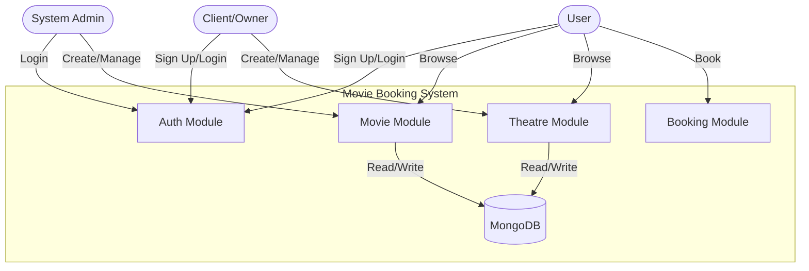
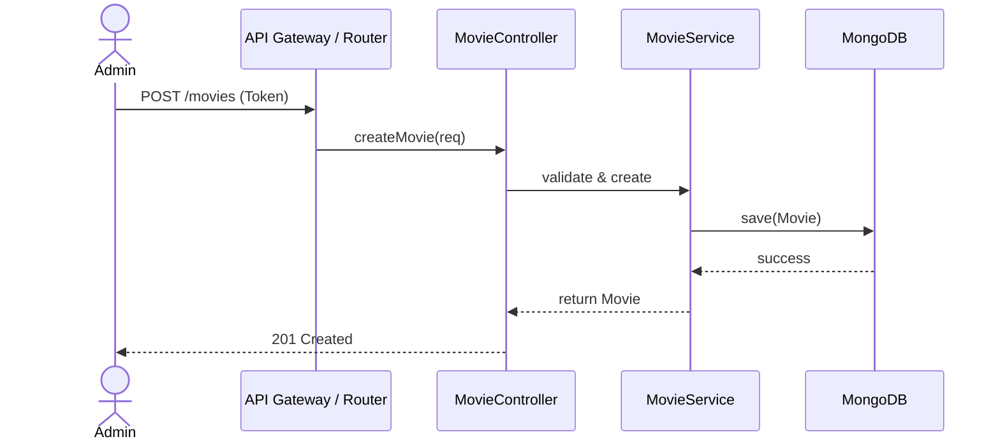
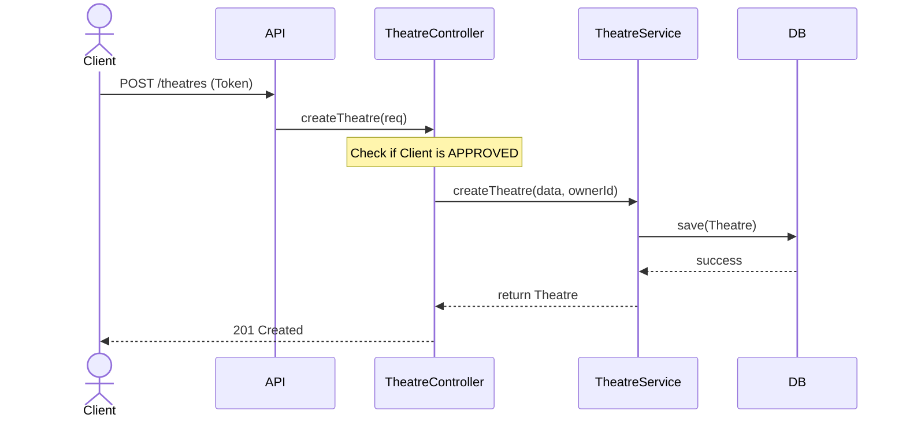
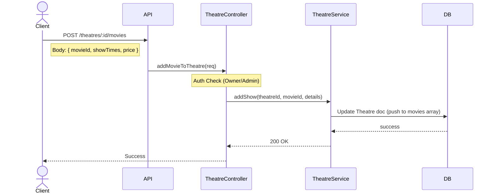
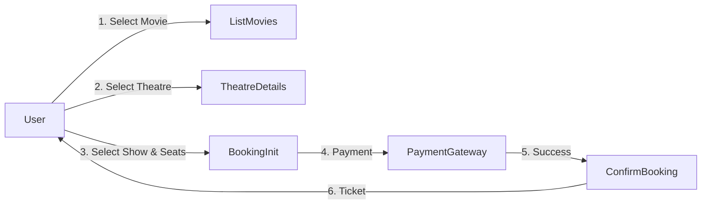

# Data Flow Diagrams

## System Overview

## 1. Movie Management Flow (Admin)

## 2. Theatre Management Flow (Client)

## 3. Mapping Movie to Theatre (Scheduling Shows)

## 4. User Booking Flow (High Level)

