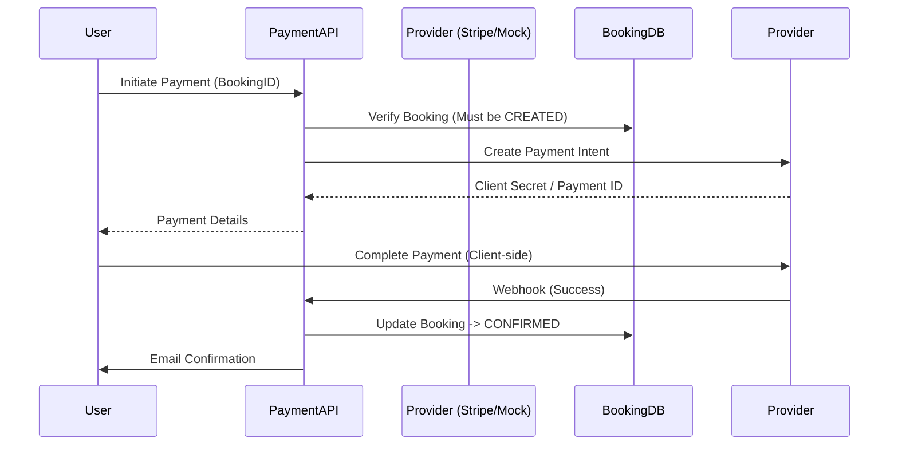

# Payments API

## Overview
The Payments module is designed as a decoupled service using the Adapter pattern. This allows easy switching between providers (Stripe, Razorpay, Mock).

## Payment Flow



## Endpoints

### 1. Initiate Payment
Starts the payment process for a booking.

- **URL**: `/mba/api/v1/payments`
- **Method**: `POST`
- **Auth**: Required

#### Request Example
```json
{
    "bookingId": "60d6a...",
    "amount": 25.0,
    "currency": "USD",
    "provider": "mock" 
}
```
*Note: `provider` is optional if default is configured server-side.*

#### Response Example (200 OK)
```json
{
    "status": "success",
    "data": {
        "payment": {
            "id": "pay_123...",
            "status": "INITIATED",
            "amount": 25.0
        },
        "clientSecret": "pi_123_secret_456" 
    }
}
```

---

### 2. Payment Webhook
Receives async updates from payment providers.

- **URL**: `/mba/api/v1/payments/webhook`
- **Method**: `POST`
- **Auth**: Signature Verification (Provider Specific)

#### Request Example (Simulated)
```json
{
    "type": "payment_intent.succeeded",
    "data": {
        "object": {
            "id": "pi_123...",
            "amount": 2500,
            "currency": "usd"
        }
    }
}
```

#### Response
- `200 OK`: Acknowledged
- `400 Bad Request`: Invalid Signature

---

### 3. Get Payment Details
- **URL**: `/mba/api/v1/payments/:id`
- **Method**: `GET`
- **Auth**: Required (Owner/Admin)

#### Response Example
```json
{
    "status": "success",
    "data": {
        "payment": {
            "id": "pay_123",
            "bookingId": "60d6a...",
            "status": "SUCCESS",
            "providerRef": "txn_789"
        }
    }
}
```
