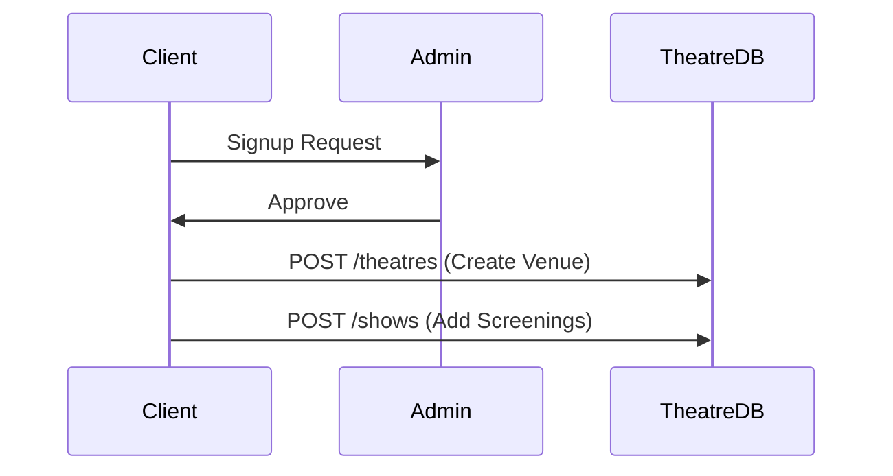

# Theatres API

## Overview
Theatres are managed by Clients (Partners). A theatre contains details about location, screens, and seat layouts.

## Client Workflow



## Endpoints

### 1. Create Theatre
- **URL**: `/mba/api/v1/theatres`
- **Method**: `POST`
- **Auth**: Required (`CLIENT` with `APPROVED` status)

#### Request Example
```json
{
    "name": "Grand Cinema Hub",
    "city": "New York",
    "address": "123 Broadway Ave",
    "pin": "10001",
    "screens": 3,
    "seatMap": {
        "Screen 1": { "rows": 10, "cols": 15, "aisles": [5] },
        "Screen 2": { "rows": 8, "cols": 12 }
    }
}
```

#### Response Example (201 Created)
```json
{
    "status": "success",
    "data": {
        "theatre": {
            "id": "60d...",
            "owner": "60a...",
            "name": "Grand Cinema Hub"
        }
    }
}
```

---

### 2. List Theatres
- **URL**: `/mba/api/v1/theatres`
- **Method**: `GET`
- **Auth**: Public

#### Query Parameters
- `city`: Filter by city (e.g., `New York`)
- `pin`: Filter by PIN code
- `movieId`: Filter theatres showing a specific movie

#### Response Example
```json
{
    "status": "success",
    "data": {
        "theatres": [
            { "id": "...", "name": "Grand Cinema Hub", "city": "New York" }
        ]
    }
}
```
